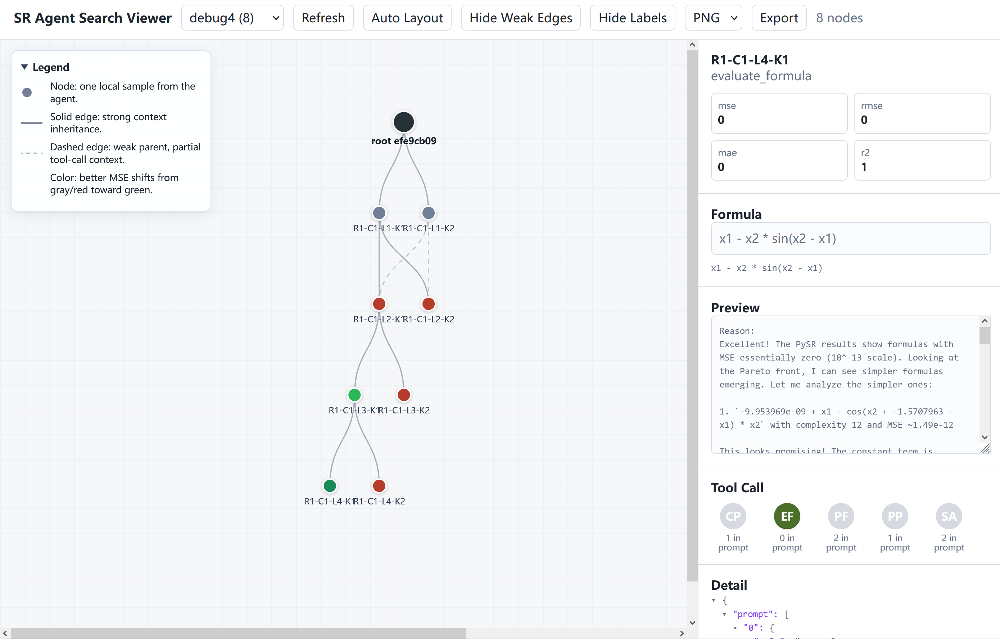

# SR Agent

符号回归（Symbolic Regression）Agent，通过 LLM 调用工具分析数据并发现数学公式。

## 安装

1. 安装依赖（参见 `install.sh`）
2. 设置 .env 文件（示例见 `.env.example`）：
  ```bash
  if [ ! -f .env ]; then
    cp .env.example .env
  fi
  # 编辑 .env 文件，填入实际的 API Key 等信息
  ```
3. 运行测试：
  ```bash
  python -m pytest tests/ -v
  ```
4. 运行示例：
  ```bash
  python run_sr_agent.py \
      -f "y = sin(x1 - x2)" \
      --x-low -10 \
      --x-high 10 \
      --llm-provider openrouter \
      --llm-model qwen/qwen3.5-flash-02-23
  ```

## Web 可视化

Agent 运行时会在 `save_path` 下写入 `manifest.json` 和 `records.jsonl`，允许通过 Web 界面实时查看搜索树（包括节点详情、工具调用和公式结果等信息）。



安装 Web 依赖：

```bash
pip install -e ".[web]"
```

启动后端（sr-agent-web 会在 logs/ 目录下递归查找所有 manifest.json 日志文件）：

```bash
sr-agent-web --log-dir logs --host 127.0.0.1 --port 8000
# python -m sr_agent.cli.web --log-dir logs --host 127.0.0.1 --port 8000  # 另一种运行方案
```

然后打开 <http://127.0.0.1:8000/>。

## 项目结构

```
├── src/sr_agent/       # 核心代码，详见 `src/sr_agent/README.md`
│   ├── tools/          # 工具定义，详见 `src/sr_agent/tools/README.md`
│   ├── api/            # LLM 接口
│   ├── parser/         # 工具调用解析器
│   ├── prompts/        # Prompt 模板（暂时用不到）
│   ├── buffer/         # 消息管理（暂时用不到）
│   ├── skills/         # 技能文档（暂时用不到）
│   ├── utils/          # 工具函数
│   └── _vendor/        # 无法通过 pip 安装的第三方库
│       └── llmsr_bench/ # LLM-SRBench 对接代码
├── tests/              # 单元测试，详见 tests/README.md
├── scripts/            # 临时性脚本和数据分析脚本
├── analysis/           # 数据分析 notebook
├── data/               # 数据文件
├── logs/               # 运行结果日志
└── playground/         # 实验性/临时代码
```

## 目录约定

- **根目录**只放具有明确功能的入口脚本（如 `run_sr_agent.py`、`bench_sr_agent.py`），避免根目录过于杂乱。
- **`scripts/`** 放临时性脚本和数据分析脚本，运行时需指定 `PYTHONPATH`：
  ```bash
  export PYTHONPATH=. && python ./scripts/xxx.py
  ```
- **`analysis/`** 放数据分析 notebook，命名格式为 `YYMMDD_xxx.ipynb`。注意控制 notebook 文件大小，避免撑爆 git 仓库。
- **`data/`** 放数据文件（已加入 `.gitignore`）。
- **`logs/`** 放运行结果（已加入 `.gitignore`）。
- **`playground/`** 放不舍得删但代码中用不到的东西（已加入 `.gitignore`）。


## 开发测试

详见 [`tests/README.md`](tests/README.md)。

```bash
python -m pytest tests/ -v
```

## 许可证

MIT License
