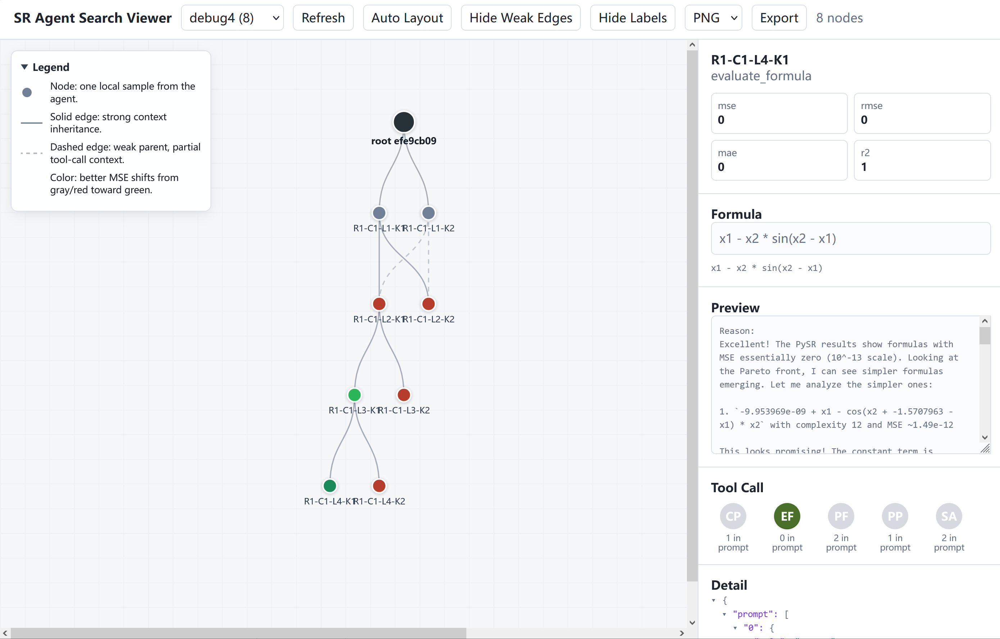

# SRHarness: A Harness for Agentic Symbolic Regression

[English](README.md) | [简体中文](README.zh.md)

SRHarness is a domain-specific runtime for **agentic symbolic regression**. It lets a large language model inspect numerical observations, choose scientific operations, evaluate competing hypotheses, and refine a symbolic expression over a long search trajectory.

This repository contains the research code for **“SRHarness: A Harness for Agentic Symbolic Regression.”** The Python package and some historical entry points retain the name `sr_agent` / `SRAgent`.

> **Research-code status:** the project is under active development. Experiment-scale runs can make many paid LLM requests and may invoke external solvers. Start with a small `R-C-L-K` configuration and inspect the generated logs before launching a benchmark campaign.

## Why SRHarness?

SRHarness organizes agentic equation discovery around three mechanisms:

- **Composable scientific actions.** Analysis, fitting, evaluation, and search tools share a common interface. Actions can operate on raw variables, transformed expressions, residuals, and other candidate-derived views.
- **Persistent scientific state.** Candidate formulas, numerical metrics, complexity, evidence, and provenance survive beyond a single conversation. Compact Pareto and top-candidate views expose useful state back to the model.
- **Trajectory lifecycle management.** A configurable `R-C-L-K` scheduler coordinates restarts, independent branches, refinement steps, and local response sampling while preserving useful intermediate results.

The included action library covers statistical and relationship analysis, formula/code evaluation, constant and structured fitting, PySR and SINDy integration, code execution, skills, and final formula submission. Tools can be enabled, disabled, or extended without changing the main agent loop.

## Results at a Glance

The accompanying paper evaluates SRHarness on LLM-SRBench, including LSR-Synth, LSR-Transform, and an anonymized LSR-Transform variant that removes scientific descriptions and variable semantics.

| Method / backbone | LSR-Transform SA | LSR-Transform-Anon SA |
|---|---:|---:|
| SRHarness + DeepSeek-v4-flash-0731 | **93.69%** | **72.97%** |
| SR-Scientist + DeepSeek-v4-flash-0731 | 62.16% | 39.64% |
| Codex + DeepSeek-v4-flash-0731 | — | 20.72% |

These are symbolic-accuracy results reported in the manuscript. See the paper for the complete numerical, symbolic, complexity, resource, and ablation results, as well as the exact evaluation protocol.

## Installation

### Requirements

- Linux is the primary tested platform.
- Python **3.12 or newer** is required.
- Git and a working C/C++ toolchain are recommended.
- Some optional actions have additional requirements, such as Julia for PySR or PyTorch for neural components.

The following setup mirrors [`install.sh`](install.sh) while using HTTPS clone URLs:

```bash
git clone https://github.com/yuzhTHU/MySRAgent.git SRAgent
cd SRAgent

conda create -p ./venv python=3.12 -y
conda activate ./venv

# nd2py is currently installed from source.
git clone https://github.com/yuzhTHU/nd2py.git ./third-party/nd2py
pip install -e ./third-party/nd2py

# Core package plus development/test dependencies.
pip install -e ".[dev]"
```

Install optional components as needed:

```bash
pip install -e ".[web]"       # Web search-tree viewer
pip install -e ".[tools]"     # PySR, gplearn, and PySINDy integrations
pip install -e ".[nn]"        # Experimental neural components
pip install -e ".[all]"       # Everything above
```

## Provider Configuration

Copy the tracked environment template once, then fill in only the providers you use:

```bash
test -f .env || cp .env.sample .env
```

For example, OpenRouter requires:

```dotenv
OPENROUTER_API_KEY="sk-or-v1-..."
```

The code also contains adapters for DeepSeek, Gemini, OpenAI/Azure OpenAI, SiliconFlow, LM Studio, and manual interaction. See [`.env.sample`](.env.sample) for the corresponding variables. Never commit `.env`; it is ignored by Git.

## Quick Start

Run a small synthetic problem:

```bash
conda activate ./venv

python run_sr_agent.py \
  --equation "y = sin(x1 - x2)" \
  --x-low -10 \
  --x-high 10 \
  --llm-provider openrouter \
  --llm-model deepseek/deepseek-v4-flash \
  --force-initial-diagnostics \
  -R 1 -C 1 -L 3 -K 1
```

This command performs paid API calls. Its search budget is controlled by:

| Symbol | Meaning |
|---|---|
| `R` | restart rounds initialized from persistent historical candidates |
| `C` | independent conversational branches per restart |
| `L` | refinement steps per branch |
| `K` | locally sampled responses per refinement step |

The nominal number of model responses is approximately `R × C × L × K`, although retries and provider behavior can affect actual usage.

### Python API

```python
import numpy as np
from sr_agent import SRAgent

x1 = np.linspace(-3.0, 3.0, 100)
x2 = np.linspace(3.0, -3.0, 100)

agent = SRAgent(
    llm_provider="openrouter",
    llm_model="deepseek/deepseek-v4-flash",
    max_restart_loop=1,
    global_width=1,
    max_refinement_depth=3,
    local_sample_size=1,
    save_path="logs/python_api_demo",
)

result = agent.fit(
    X={"x1": x1, "x2": x2},
    y={"y": np.sin(x1 - x2)},
    problem_description="Discover y as a function of x1 and x2.",
)
print(result["best_formula"])
```

## LLM-SRBench Evaluation

Download the benchmark data. Git LFS may be required:

```bash
git lfs install
git clone https://huggingface.co/datasets/nnheui/llm-srbench \
  ./data/llm-srbench-data
```

Run one LSR-Transform problem before scaling up:

```bash
python bench_sr_agent.py \
  --algorithm my_sr_agent \
  --datasets lsrtransform \
  --problem-names II.6.15b_1_0 \
  --exp-name smoke_lsrtransform \
  --llm-provider openrouter \
  --llm-model deepseek/deepseek-v4-flash \
  -R 1 -C 1 -L 3 -K 1
```

Add `--anonymize` to replace variable names and scientific descriptions with generic input/output labels while leaving the numerical observations unchanged:

```bash
python bench_sr_agent.py \
  --algorithm my_sr_agent \
  --datasets lsrtransform \
  --problem-names II.6.15b_1_0 \
  --exp-name smoke_lsrtransform_anon \
  --anonymize \
  --llm-provider openrouter \
  --llm-model deepseek/deepseek-v4-flash \
  -R 1 -C 1 -L 3 -K 1
```

The benchmark entry point also contains adapters for conventional and LLM-based baselines; `python bench_sr_agent.py --help` lists its general options, while each adapter defines its method-specific flags. Paper-scale reproduction requires the exact model, toolset, data split, token limit, seed, and `R-C-L-K` configuration reported with each experiment; the smoke commands above intentionally use a much smaller budget.

## Logs and Web Visualization

When `save_path` is enabled, SRHarness writes append-only search artifacts including:

- `manifest.json`: run configuration and visualization metadata;
- `records.jsonl`: search-tree nodes, prompts, actions, results, and usage;
- `response.jsonl`: raw model responses and token/cost accounting;
- `tool_calls.jsonl`: tool invocations and outputs;
- `search_record.jsonl`: the evolving candidate/Pareto state;
- result and text log files produced by the selected entry point.

Install and launch the web viewer:

```bash
pip install -e ".[web]"
sr-agent-web --log-dir logs --host 127.0.0.1 --port 8000
```

Then open <http://127.0.0.1:8000/>. The server recursively discovers runs containing both `manifest.json` and `records.jsonl`.



## Evaluation and Reproducibility Notes

- Benchmark test observations are not exposed during search or candidate selection.
- The agent can reserve part of the visible training data for random or OOD-style validation using `--validation-fraction` and `--split-by`.
- Numerical predictions are evaluated through the shared benchmark pipeline. Symbolic equivalence is implemented in [`src/sr_agent/utils/symbolic_acc.py`](src/sr_agent/utils/symbolic_acc.py).
- Logs preserve prompts, model responses, tool calls, candidate provenance, token usage, and recorded cost so that a run can be audited after completion.
- API behavior, model aliases, prices, and stochastic outputs can change over time. Record the exact provider model identifier, source revision, arguments, and environment for serious comparisons.

## Extending SRHarness

New scientific actions inherit `BaseTool`, declare stable metadata, and return a serializable result. Candidate-producing actions should use the shared evaluation contract so their formulas, train/validation metrics, complexity, diagnostics, and provenance can enter persistent scientific state consistently.

See:

- [`src/sr_agent/README.md`](src/sr_agent/README.md) for the agent loop and internal architecture;
- [`src/sr_agent/tools/README.md`](src/sr_agent/tools/README.md) for the action API and custom-tool guide;
- [`tests/README.md`](tests/README.md) for testing conventions.

## Project Layout

```text
├── src/sr_agent/        # Core package
│   ├── api/             # LLM provider adapters
│   ├── parser/          # Native/text/JSON/XML tool-call parsing
│   ├── tools/           # Scientific actions and shared evaluation contract
│   ├── skills/          # Reusable agent-facing scientific instructions
│   ├── utils/           # Metrics, symbolic accuracy, logging, and utilities
│   ├── web/             # Search-tree recording and viewer backend
│   └── _vendor/         # Integrated benchmark/baseline adapters
├── tests/               # Unit and integration tests
├── scripts/             # Experiment and analysis utilities
├── analysis/            # Analysis notebooks
├── data/                # Local datasets; ignored by Git
├── logs/                # Run artifacts; ignored by Git
└── playground/          # Temporary experiments; ignored by Git
```

Repository conventions:

- Keep stable entry points such as `run_sr_agent.py` and `bench_sr_agent.py` at the repository root.
- Put experiment and analysis utilities under `scripts/`.
- Name analysis notebooks as `YYMMDD_description.ipynb` and avoid committing large outputs.
- Treat `data/`, `logs/`, and `playground/` as local working directories.

## Testing

The default test configuration excludes tests marked `slow` or `paid`:

```bash
python -m pytest tests/ -v
```

Run paid or slow integration tests only when the required services and budget are available.

## Citation

If you use this code, please cite **“SRHarness: A Harness for Agentic Symbolic Regression.”** A copy-ready BibTeX entry and public paper link will be added when the paper record becomes publicly available.

## License

SRHarness is released under the [MIT License](LICENSE).
